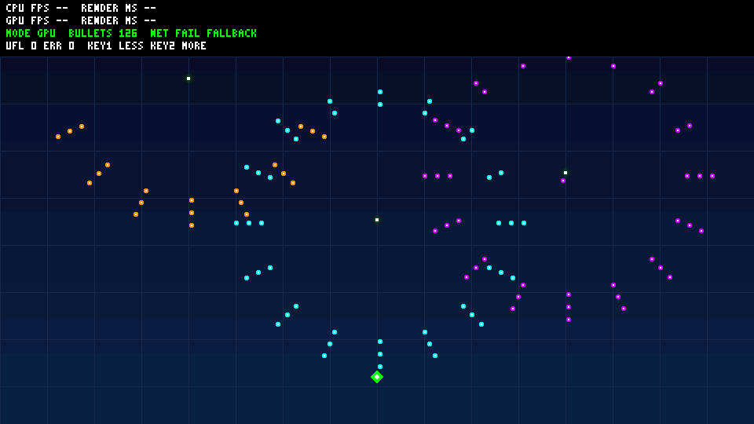

# Bullet rendering offline acceptance — 2026-09-27

Base: main a82f3dd, imported into A-work by merge 4da23d7. Main branch is not
modified. Feature has zero delta under board/, chisel/, generated/efinix_gpu/
and release/. No Efinity regeneration, pin/clock changes or bitstream writing.

## Verified candidate

- Original dark-grid RGB565 background, three 8x8 keyed bullet colors, fixed
  player marker, ring/fan/spiral motion, three small alpha emitter tiles.
- Bounded fixed-point pool and command buffer; 32/64/128/256/512 target tiers.
- Same-state 30-frame CPU/GPU replay; legacy scene preserved as DEMO=legacy.
- Separate IDs 101/102 with the existing Ethernet resource protocol/full CRC.
- Disjoint local fallback, including DMA abort-timeout/late-write regressions.
- On-screen count excludes clipped rectangles with no opaque bullet texels.

## Final commands and results

| Command | Observed result |
|---|---|
| `./scripts/test-bullet-demo.ps1` | PASS state/replay/10,000-step recycling, clipping/capacity, generated assets, independent pixels at all five tiers, legacy scene and unchanged production pixel RTL |
| `./scripts/test-bullet-regression.ps1` | PASS 12 existing C suites; two Python UDP tests for each of the V2 and bullet manifests |
| `./scripts/build-bullet-firmware.ps1 -Demo bullet` | PASS ELF/BIN/HEX: text 19,856 bytes, data 0, BSS 72,344; stack-use warning threshold 2,048 bytes |
| `./scripts/build-bullet-firmware.ps1 -Demo legacy` | PASS ELF/BIN/HEX: text 17,130 bytes, data 0, BSS 47,496 |
| `git diff --check` | PASS |
| `git diff origin/main --name-only -- board chisel generated/efinix_gpu release` | No changed paths |

Icarus representative frame: target 128 slots, **126 actually visible bullets**,
134 scene commands, 599,508 pixel operations including HUD:
COPY 518,400; ColorKey 8,296; Alpha 432; Fill 72,380.
70,532 stalled-output cycles were checked for stable pixel/write-enable.
The independent framebuffer CRC32 is **1846b9be**. Legacy CRC remains **8e341090**.
HUD worst-value regression remains 686/1024 commands.

The official BSP linker emits the existing RWX LOAD-segment warning in both
configurations; neither link failed. Host compiler is native MinGW GCC 8.1,
not an ASan/UBSan environment. Firmware uses C:/efinity GCC 13.4 and the user's
read-only official Ti60 co_debug Sapphire BSP. Windows host pointers are
relocated only in tests to avoid a process-heap address conflict.

## Evidence and limits

Logs, gzip-compressed VCD and SHA256 manifest are in
[evidence/bullet-demo/](evidence/bullet-demo/manifest.json).
Raw VCD, vectors, framebuffer and candidate ELF/BIN/HEX remain under
generated/verification/bullet-demo/ and can be reproduced by the scripts.

The fresh read-only code review identified unsafe reuse of DMA destinations
after abort timeout, key-only visibility overcount and incomplete fallback
coverage. All were addressed in one fix pass with regressions observed failing
before restoration; final suites are green. No minor finding is deferred.

The RTL test exercises actual production pixel math, transparency and
backpressure; it is not a complete Sapphire/APB/AXI/DDR/HDMI simulation.
No physical board was available. FPS, 300 uninterrupted stable frames,
disconnect behavior, HDMI appearance, keys and endurance remain unverified.
The firmware's windowed 300-sample output is not formal continuous-load
acceptance. Character input, collision/scoring and a complete playable game
remain future tasks intentionally excluded from this rendering-only change.
