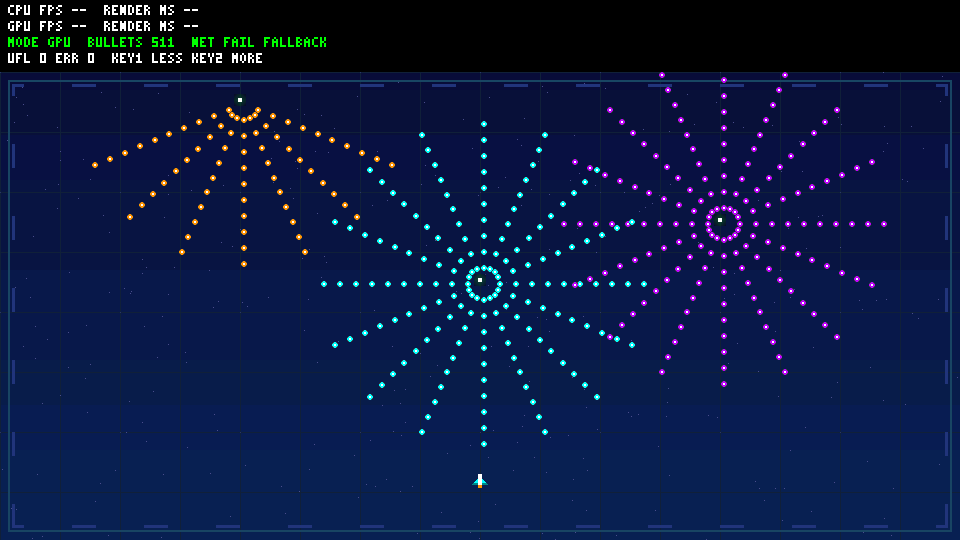
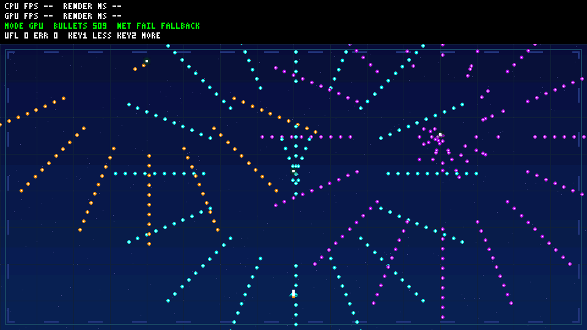
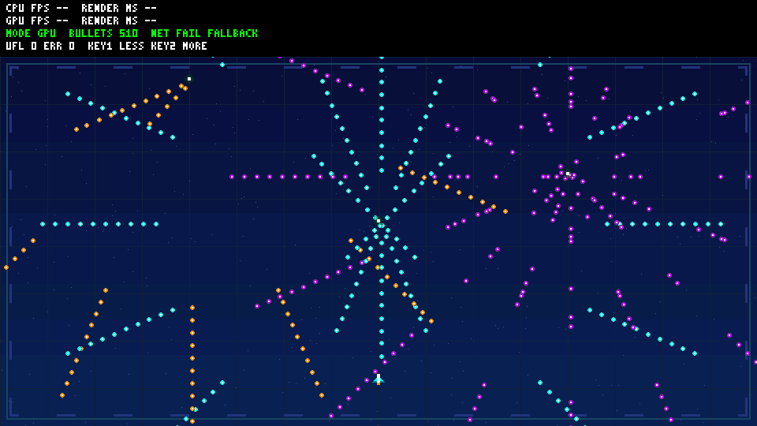

# R2 rendering follow-up — offline only

Base: A-work 5cd3808, hardware/main a82f3dd. No RTL, clock, pin, opcode,
bitstream or existing release changes. Controls remain deferred.

Changes: original space/circuit background, outlined bright bullets and ship
marker, with identical network and local fallback bytes. Sprite dimensions,
opaque bullet silhouette, fixed-point trajectories and shared CPU/GPU replay
are unchanged. No third-party art is copied; noncommercial use is not treated
as a blanket copyright exemption.

HUD now caches its full 960x72 raster in DDR 0x02c10000..0x02c31c00.
Only displayed text changes invalidate it. One COPY replaces hundreds of
per-frame glyph FILL commands; both comparison modes still copy the same HUD
on the CPU, outside scene-only render timing. Cache rebuild cost is included
in frame wall time. Added BSS is small; scratch commands stay static, not on
the board's 4 KiB stack. Main synchronizes DDR before reading the cache.

## Verification

Exact commands from repository root (native GCC path on this machine):

```powershell
./scripts/test-bullet-demo.ps1 -HostGcc D:/aaa/mingw64/bin/gcc.exe
./scripts/test-bullet-regression.ps1 -HostGcc D:/aaa/mingw64/bin/gcc.exe
./scripts/build-bullet-firmware.ps1 -Demo bullet
./scripts/build-bullet-firmware.ps1 -Demo legacy
```

Tests cover canonical-text invalidation, unchanged-text reuse, A/B buffer
copies, cache canary, original HUD versus cached pixels, all-tier independent
scalar oracle, both partial network failures and late writes, original legacy
CRC, plus unchanged production pixel-pipe replay with backpressure. Actual
metrics and artifact SHA-256 values are parsed into
[manifest](evidence/bullet-demo-r2/manifest.json), not hardcoded from R1.
Native tests are not sanitizer runs. Firmware linking is not board execution.

Representative 128-slot frame: 126 visible bullets, 134 scene commands,
596296 pixel operations, CRC f1b1cefe. Cached COPY coverage is 587520 pixels
(518400 background + 69120 HUD), plus KEY 8296, ALPHA 432 and FILL 48.

512-slot previews use real rendered frames with oracle equality, not mockups:

| Logical tick | Visible bullets | Scene commands | Frame CRC |
| --- | --- | --- | --- |
| 0 | 511 | 519 | 3123ffad |
| 90 | 509 | 517 | 5a5d2759 |
| 180 | 510 | 518 | 022e4294 |





No measured FPS is invented in these images. Pixel-pipe simulation does not
verify full SoC command execution, AXI/DDR behavior, physical HDMI or board
endurance; no stable-60 claim is made. Detailed logs and compressed waveform
are archived beside the manifest; R1 evidence remains intact.

Final runs: render/state/assets/cache/legacy checks and 596296 RTL pixel
operations passed; 12 existing native C suites and both real localhost UDP
catalog transfers passed; bullet and legacy RV32 configurations linked.
Bullet text/BSS: 21048/72608 bytes; legacy: 17130/47496 bytes. Both fit the
official 124 KiB RAM linker region with 4 KiB stack; stack warnings are errors
at 2048 bytes per function. The inherited official linker RWX LOAD-segment
warning remains, as in R1; no hardware/linker redesign was performed.

Fresh read-only review found one important unreachable bullet-outline branch.
An explicit outer-opaque-ring assertion failed before the fix; both C/Python
thresholds now select r>=34. Assets, successful logs, previews and receipts
were regenerated after the fix. No other important/critical or deferred minor
findings were reported.
