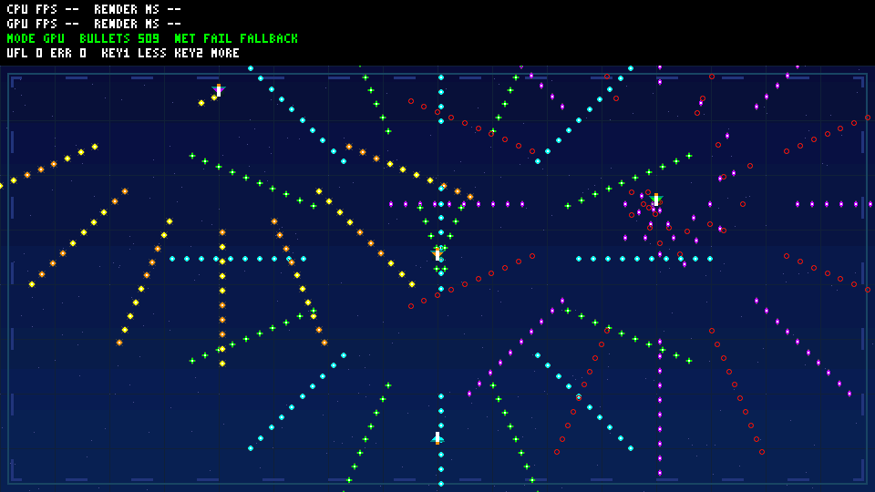

# R3 aircraft emitters and six bullet shapes — offline only

Base: A-work b03e816; unchanged hardware/main a82f3dd. User requested aircraft
emitters and multiple bullet shapes; no new gameplay, character control or
hardware is introduced. All assets are original procedural RGB565.

The three former 4x4 white emitter squares are now downward-facing 16x16
aircraft (orange, purple and green). The fixed player ship remains upward-facing.
Six bullet shapes are round, diamond, needle, cross, eight-point star and hollow
ring. Each is 8x8, with a real distinct opacity mask and a distinct color.
Shape selection is deterministic by slot; trajectory/pattern and 30-frame
CPU/GPU replay pairing are unchanged. No per-frame allocation or floating point.

## Resource compatibility

Atlas size is now **3104 bytes** (was 1184). IDs 101/102 and the existing GET/DATA
network protocol are unchanged; use the new atlas and generated CRC header
together with the new firmware. Do not mix old atlas bytes with new firmware:
CRC verification will reject them and regenerate the disjoint local fallback.
R1/R2 historical artifacts are preserved rather than overwritten.

| Atlas byte offset | Bytes | Contents |
| --- | --- | --- |
| 0 | 768 | six 8x8 bullet tiles |
| 768 | 512 | upward-facing player ship |
| 1280 | 288 | 12x12 alpha glow |
| 1568 | 1536 | three downward-facing aircraft |

The atlas still starts at network DDR 0x02a00000 or fallback 0x02c00000;
it ends before HUD cache 0x02c10000. Command capacity remains 520. A fully
visible 512-slot scene uses 520 scene commands (background, 512 bullets,
player, 3 glows, 3 aircraft); HUD uses its separate cached COPY.

For partially clipped bullets only, a bounded analytic mask scan excludes
key-only rectangles from the HUD visible count. Full tiles avoid scanning;
48 corner/edge cases are checked against actual generated atlas bytes.

## Verification and result

From repository root:

```powershell
./scripts/test-bullet-demo.ps1 -HostGcc D:/aaa/mingw64/bin/gcc.exe
./scripts/test-bullet-regression.ps1 -HostGcc D:/aaa/mingw64/bin/gcc.exe
./scripts/build-bullet-firmware.ps1 -Demo bullet
./scripts/build-bullet-firmware.ps1 -Demo legacy
```

Test-first observations: atlas-size/mask/plane test failed against the old
generator; shape/source/aircraft command test failed before the new interface
existed. Both passed after implementation. Literal masks cover every texel
of every bullet. Complete C fallback bytes equal Python/network resources,
including both partial-resource failure paths and late DMA writes.
Independent scalar pixel oracle checks all five tiers and the real 512-slot
previews; original legacy scene CRC remains 8e341090.

Representative frame: 126 visible bullets, 134 scene commands, **597016** RTL
pixel operations, CRC **febd17ef**. COPY=587520, KEY=9064, ALPHA=432, FILL=0;
70238 backpressure stall cycles. Aircraft replace FILL markers with COLOR_KEY,
so scene pixel work grows by 720 pixels, not by extra commands. Production RTL
is unchanged; only the software vectors and simulation expectations change.

| 512-slot logical tick | Visible | Scene commands | CRC32 |
| --- | --- | --- | --- |
| 0 | 511 | 519 | 6b66d3a3 |
| 90 | 509 | 517 | b8841df6 |
| 180 | 510 | 518 | 2374d7cf |



Actual logs, compressed waveform, previews and SHA-256 receipt are archived
in [R3 evidence](evidence/bullet-demo-r3/manifest.json). This is offline native
host/pixel-pipe validation, not sanitizers, full SoC simulation, physical DDR/
HDMI verification or measured FPS. Controls/collisions are still deferred.

Final native regression: 12 existing C suites and both real localhost UDP
catalog transfers passed. RV32 bullet text/BSS: 21578/72608 bytes, legacy:
17130/47496 bytes, within the official linker RAM region and stack checks.
The existing official-linker RWX LOAD warning remains; release files and
linker design are untouched. Firmware artifacts are build candidates only.

Fresh read-only review found no critical or important issue. The one stale
test-description comment was corrected to keyed aircraft; this is a comment-
only change and does not alter the verified code. Reviewer confirmed atlas
masks/offsets, bounded clipping, command capacity and all 15 evidence hashes.
Board behavior and gameplay remain the documented deferred acceptance items;
unrelated untracked official demos and old waveform files remain untouched.
