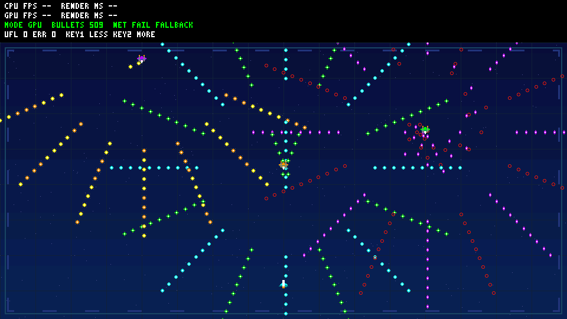

# R4 distinct friendly/enemy aircraft — offline only

Base: A-work 6d8ba35; main/hardware a82f3dd remain unchanged.
User requested different friendly/enemy shapes. This is a bounded original
software-art change: the player retains its narrow pointed fighter, while
enemies become broad-wing twin-engine aircraft with a short nose and side
nacelles. The enemy is no longer a rotated/recolored player silhouette.

All aircraft sprites remain 16x16. Atlas size stays 3104 bytes with the R3 offsets,
network IDs 101/102, memory layout, six bullet shapes, emitter locations,
trajectories, replay logic and command count unchanged. Only enemy texels and
atlas CRC change. Use the new atlas/header and firmware together; old atlas
CRC will be rejected and the identical disjoint local fallback regenerated.

## Test-first and verification

An orientation-normalized mask-difference assertion failed against R3:
zero differing pixels, proving that its enemy was only the mirrored player.
The new enemy passes a minimum 40 differing opacity pixels against the
same-facing player. Literal 16x16 enemy-mask fixtures check all pixels of all
three planes, plus noses/transparent corners. Existing full C/Python byte
comparison checks actual fallback and network asset identity, including both
partial-load failures and late DMA writes.

Actual orientation-normalized silhouette difference is 76 of 256 pixels.
Byte comparison against R3 confirms the first 1568 atlas bytes (all bullets,
player and glow) are unchanged; only the three enemy tiles differ.

Commands from repository root:

```powershell
./scripts/test-bullet-demo.ps1 -HostGcc D:/aaa/mingw64/bin/gcc.exe
./scripts/test-bullet-regression.ps1 -HostGcc D:/aaa/mingw64/bin/gcc.exe
./scripts/build-bullet-firmware.ps1 -Demo bullet
./scripts/build-bullet-firmware.ps1 -Demo legacy
```

Final render/state/cache/pixels/legacy suite passed. Independent all-tier
oracle plus unchanged production pixel RTL passed **597016** pixel operations:
COPY=587520, KEY=9064, ALPHA=432, FILL=0, stalls=70238. Representative 128-slot
frame: 126 clipped-visible bullets, 134 commands, CRC **d6ea03f7**.
Original legacy CRC remains 8e341090. Twelve existing native C suites and
both real localhost UDP catalog transfers passed.

| 512-slot tick | Clipped-visible bullets | Commands | CRC32 |
| --- | --- | --- | --- |
| 0 | 511 | 519 | 7fbfd041 |
| 90 | 509 | 517 | 73bfc687 |
| 180 | 510 | 518 | 4ae929f5 |

Both RV32 builds passed: bullet text/BSS 21792/72608 bytes; legacy
17130/47496 bytes. Stack-usage checks remain enabled; inherited official
linker RWX LOAD warning remains. No hardware/linker or release changes.



Actual previews, logs, compressed waveform and artifact hashes are preserved
in [R4 evidence](evidence/bullet-demo-r4/manifest.json); R1/R2/R3 evidence is
untouched. Native tests are not sanitizer runs. No board FPS, full SoC/DDR/
HDMI acceptance, gameplay or input-control claim is made.

Fresh read-only review found no critical or important issue and confirmed the
76-pixel silhouette difference, unchanged player/bullet/glow bytes, C/Python
geometry and CRC 9d6b31f2. One wording correction now explicitly says aircraft
sprites, not all sprites, remain 16x16. No deferred minor findings remain.
