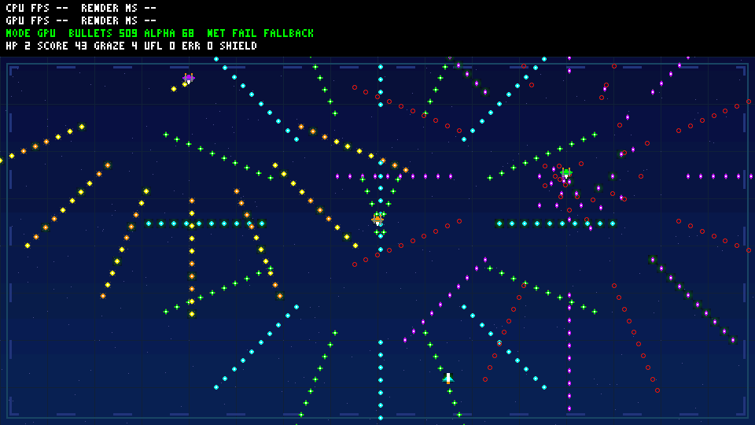

# R5 bounded Alpha effects and auto-pilot survival mechanics

Base: A-work 9e467a5, unchanged board/main a82f3dd. User explicitly extended
the previous rendering-only scope to add Alpha work and game mechanisms.
No hardware change, physical-input transport or full-game acceptance is implied.

## Design and gameplay

All game logic runs in the existing fixed-point software update. The player
automatically follows a horizontal triangle path x=300..660, y=480, over 240
logical updates; it begins at x=480. This is an unattended demonstration, not
a keyboard-controlled game. KEY1/KEY2 still select only the object-count tier.

- Three HP on reset. Collision tests the bullet's real opaque mask against a
  circular radius-3 player core, not the entire 16x16 fighter artwork.
- A hit removes one HP and recycles the contacting bullet. At most one damage
  event per update. The next 60 logical updates are protected; the shield is
  rendered more strongly during protection.
- Opaque texels within radius 12, without a core hit, award 10 graze points
  once per bullet lifetime. Recycling clears the graze flag. Each 30 living
  logical updates adds one survival point. Score/graze counters saturate at
  UINT32_MAX; HUD score/graze fields cap at 999999/9999 for bounded text.
- At zero HP the player is hidden, the bullet world freezes, and HUD shows
  OVER. After 120 logical updates, HP/score/grazes reset and a new round starts;
  the outer replay tick remains monotonic across this restart.
- The existing benchmark still resets the whole sequence at 600 logical
  updates. CPU/GPU each replay the same 30-update snapshot including HP,
  per-bullet graze flags, score, movement and protection/death timers. Therefore
  this comparison display repeats each logical window twice, rather than
  advancing a human-controlled game every displayed frame. No time rule is
  presented as seconds or a measured 60 FPS.

## Alpha workload and bounded storage

One 12x12 green Alpha halo per eight bullet slots (maximum 64), the existing
three emitter glows, and one player shield yield at most **68 Alpha commands**.
Bullet halos pulse at alpha 64..124, emitter glows use 80, and the shield uses
64 normally/192 while protected. Alpha sampling is slot-deterministic, not
performance-dependent. Halos are drawn before keyed bullet cores so core
colors remain sharp. Glow=0 disables all Alpha effects for a future controlled
comparison; no FPS gain is claimed.

The fully visible 512-slot live scene is bounded to **585 scene commands**,
with 9792 Alpha pixel operations versus R4's 432 (22.67x). HUD has one separate
COPY. Stream exhaustion clears all counts rather than exposing a partial frame.
Sprite dimensions, 3104-byte atlas, CRCs, network IDs/DDR layout and hardware
opcodes are unchanged. The existing global-Alpha unit blends opaque RGB565
tiles; these are not per-texel-Alpha or additive-blending shaders.

Nearby collision checks use a cheap broad phase and at most 64 mask texels;
there is no O(N²) all-object collision, dynamic allocation or floating point.
Added commands and graze flags live in BSS, not the official 4 KiB stack.

## Test-first evidence and final results

New gameplay/effect-budget tests were RED before their fields/APIs existed,
then GREEN. They cover simultaneous hits, exact protection expiry, one-time
graze, invalid-state rejection before mutation, death/freeze/restart, literal
auto-pilot coordinates, 585-command capacity, effect-off behavior and gameplay
state replay identity. HUD tests were RED before gameplay fields existed,
then GREEN for labels, cache invalidation, maximum field widths and exact A/B
raster equality. Receipt tests were RED before gameplay/Alpha parsing, then
GREEN, including rejection of host-versus-RTL Alpha-count mismatch.

Commands from the repository root:

```powershell
./scripts/test-bullet-demo.ps1 -HostGcc D:/aaa/mingw64/bin/gcc.exe
./scripts/test-bullet-regression.ps1 -HostGcc D:/aaa/mingw64/bin/gcc.exe
./scripts/build-bullet-firmware.ps1 -Demo bullet
./scripts/build-bullet-firmware.ps1 -Demo legacy
```

Independent all-tier CPU oracle, original asset/fallback/late-DMA checks,
legacy CRC 8e341090 and unchanged production RTL replay passed. Representative
128-slot tick 90: visible=126, commands=151, HP=3, score=3, grazes=0,
Alpha commands=20, Alpha pixels=2880; full-frame CRC **fce196ed**.
RTL: **599464** operations, COPY=587520, KEY=9064, ALPHA=2880, FILL=0;
70526 stall cycles. This validates actual overlap/blend math, not the full SoC.

| 512-slot tick | Visible | Commands | Alpha commands / pixels | HP / score / grazes | CRC32 |
| --- | --- | --- | --- | --- | --- |
| 0 | 511 | 584 | 68 / 9792 | 3 / 0 / 0 | 1b5b3238 |
| 90 | 509 | 582 | 68 / 9648 | 2 / 43 / 4 | 17a874a0 |
| 180 | 510 | 583 | 68 / 9732 | 2 / 86 / 8 | 10d3603d |



Additional shield and game-over images come from **controlled collision
fixtures**, not a claimed natural playthrough: both are independently
pixel-checked through the actual update/renderer. Shield: HP=2, protection=60,
CRC 4ef74b6e; game over: HP=0, protection=0, CRC 81b42e44.

Twelve original C suites and both real localhost UDP catalogs passed.
RV32 text/BSS: bullet 23264/78832 bytes; legacy 17434/47496 bytes. Both linked
within the official RAM/stack constraints. The legacy binary grows slightly
because the shared HUD supports gameplay fields, but its selected behavior
and framebuffer CRC are unchanged. The inherited linker RWX LOAD warning
remains; no linker or board-tested release files were changed.

Logs, previews, compressed waveform and measured metadata/hashes are in
[R5 evidence](evidence/bullet-demo-r5/manifest.json), preserving R1..R4 history.
Native tests are not sanitizer runs. No physical-board FPS/endurance, full
SoC/DDR/HDMI acceptance, player input or complete game claim is made.

Fresh read-only review found no critical/important issue and confirmed the
damage/protection, restart, Alpha limits/ordering and HUD bounds. Its minor
coverage suggestion was addressed with score/graze saturation and grazed-
bullet recycling/re-scoring assertions. This changed tests only; production
code, RTL vectors and firmware are unchanged. The focused fresh run is archived
as final-gameplay-boundaries.log, avoiding another complete simulation.
