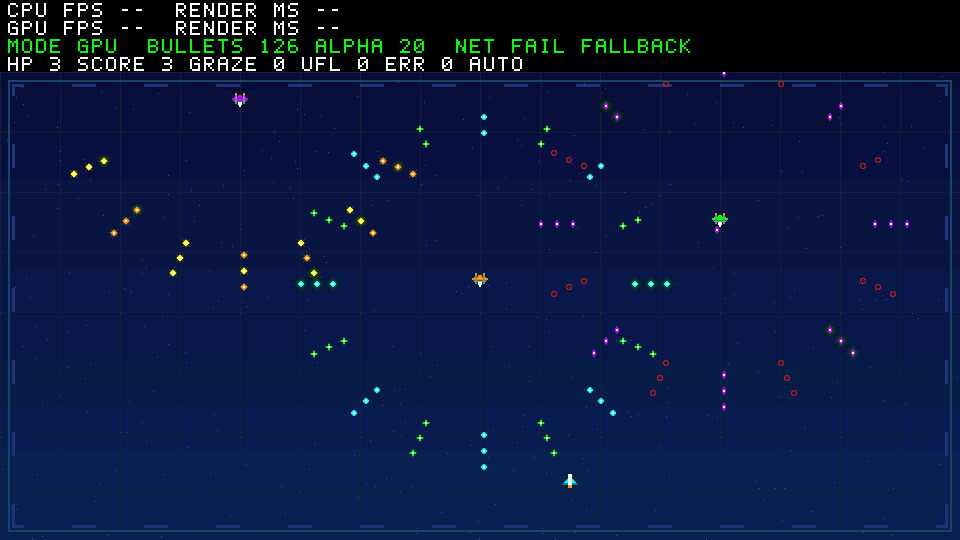

# R6 性能 HUD 字体清晰度修复

基于 A-work 1c5c062；只修改软件 HUD 字体和离线测试/记录。
硬件、游戏状态、性能计数与测量口径、网络素材、V2 发布包均未更改。
不修改 main 分支。

## 原因与修复

旧比较 HUD 使用 3×5 字形，放大后每字仅 6×10 像素、字间 2 像素；
M/N/W 等复杂字母笔画过于拥挤。旧离线图未出现字符矩形真正重叠，
但低分辨率字形和狭窄留白会造成粘连观感；没有开发板，不能断言实际
HDMI 的缩放或采样情况。

比较 HUD 改用 5×7 字形，2×整数放大，每字占 10×14 像素、字符步进
14 像素、行步进 18 像素，因此字间/行间均留白 4 像素。M/N/W、I/1、
O/0 使用不同轮廓，0 带内部斜线。起点 (8,3)，四行末行止于 y=70；
最长 63 字符也能放进 960 像素宽度，不遮挡从 y=72 开始的游戏场地。
仍使用 960×72 黑底、绿色模式行和白色指标行，不添加插值或模糊滤镜。

字形相同水平笔画在连续行中合并为矩形，保持原有 1024 条命令容量和
BSS，不扩大固件 scratch 缓冲。HUD 缓存地址/大小、变化时更新与逐帧
COPY 不变。旧紧凑数字 HUD API 的 3×5 字体和几何保持兼容。

## 验证

先增加真实栅格像素测试，在旧字体上因字形像素不符失败，再实现修复。
独立手写 C/P/U/M 位图验证 2×像素，逐字符检查黑色间隔，检查四行留白、
极大计数字段、SHIELD/断网最长文本、命令界限以及 72 行 DDR 哨兵。
缓存和直接渲染仍逐像素相等；同一文字不重复更新缓存。

执行以下完整检查各一次（此前仅运行针对字体的 RED/GREEN 测试）：

```powershell
./scripts/test-bullet-demo.ps1 -HostGcc D:/aaa/mingw64/bin/gcc.exe
./scripts/test-bullet-regression.ps1 -HostGcc D:/aaa/mingw64/bin/gcc.exe
./scripts/build-bullet-firmware.ps1 -Demo bullet
./scripts/build-bullet-firmware.ps1 -Demo legacy
```

五个对象档位的独立 CPU 像素比较、缓存、游戏机制、素材与原有 12 个 C
回归套件、两套真实 localhost UDP 资源目录均通过。原性能场景 HUD 前
CRC 仍为 8e341090。极大旧比较场景使用 601/1024 条 HUD 构建命令；
最长游戏字段也通过容量/位置检查。Icarus 复用未修改的生产像素 RTL，
完整代表帧依然为 599464 操作：COPY=587520、KEY=9064、ALPHA=2880、
FILL=0，背压停顿 70526 周期。HUD 更换字体只改变画面像素，不改变该
向量的 COPY 工作量；不据此声称板测 FPS 提升。

刷新后的完整帧 CRC：代表 128 档 tick90 为 3ef381d7；512 档 tick0/90/180
分别为 d116c2ef / 9c72e078 / b9b96e3a。受控护盾/失败测试图分别为
f4269214 / ac3cd8ce，不代表自然游戏流程。

RV32 text/BSS：bullet 23488/78832 字节，legacy 17658/47496 字节。
两版均满足现有 124 KiB RAM 与 4 KiB 栈约束；保留原链接脚本的 RWX
LOAD 警告，未触碰板测 release。原生测试未使用 sanitizer。



新日志、预览、压缩波形和固件哈希见
[R6 证据](evidence/bullet-demo-r6/manifest.json)；R1～R5 证据保持原样。
一次独立只读审查未发现关键或重要问题，确认可提交 A-work。测试覆盖
极大字段和最长文本，但并未穷举所有数字组合的命令数量；不将这一
覆盖范围说成穷举证明，命令容量检查仍保留。
这些结果仅验证主机软件和像素流水线；整机 RISC-V/DDR/HDMI、实际显示
清晰度与帧率仍须由负责人上板确认。
