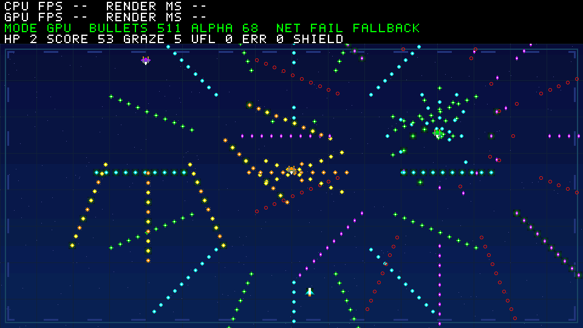
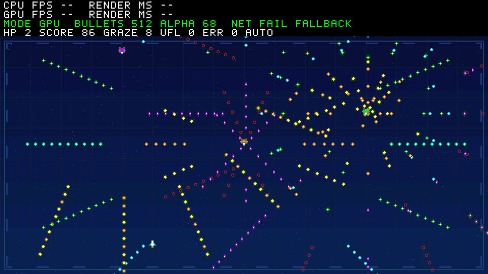

# R7 循环弹幕与发射预警（仅软件、离线验证）

每 60 个存活逻辑帧切换一段弹幕，共四段循环。中间与右侧敌机的再发射弹道逐段转向；左侧敌机的下射扇面在右偏和左偏的五条弹道之间交替。被回收的弹丸按阶段以 1.5、1.75、2、2.25 像素/帧飞行，并轮换现有六种弹形。切换前 16 帧，三架敌机已有的 12×12 Alpha 光晕逐渐变亮，切换后恢复。阵亡时阶段计时暂停、新增敌机预警恢复常亮；原有弹丸光晕仍按全局帧计时呼吸，重开后阶段恢复第一段。

没有增加弹丸槽位、贴图、绘制命令、Alpha 像素、DDR 区域或硬件修改；最大帧预算仍为 585 条场景命令、68 条 Alpha 命令、9,792 个 Alpha 像素。CPU 和 GPU 仍读取同一状态快照及命令流，30 帧窗口回放与 600 帧重置规则不变。这是无人操作的自动演示，不代表已经接入实体按键，也不实施待负责人批准的 CPU→GPU 单向切换。

本次只执行一轮完整弹幕离线测试：`./scripts/test-bullet-demo.ps1 -HostGcc D:/aaa/mingw64/bin/gcc.exe` 通过，包括四段速度/方向/弹形、预警光晕、原有受击与擦弹边界、32/64/128/256/512 档像素比对，以及未改动 RTL 的 599,464 像素回放仿真。512 档位截帧如下；均为离线软件输出，不能作为上板画质或 FPS 的证明。

另执行一轮 `./scripts/test-bullet-regression.ps1 -HostGcc D:/aaa/mingw64/bin/gcc.exe`：原有 12 组 C 回归与 V2/弹幕两套 UDP 资源目录测试均通过。

| 逻辑帧 | 用途 | 可见弹丸 | 场景命令 | 帧 CRC32 |
| --- | --- | ---: | ---: | --- |
| 110 | 第二段切换前预警 | 511 | 584 | `505248a8` |
| 180 | 第四段弹幕 | 512 | 585 | `25d53afc` |

`./scripts/build-bullet-firmware.ps1 -Demo bullet` 也完成 RV32 ELF/BIN/HEX 链接：text 23,600 B，data 0 B，BSS 78,832 B。链接器仍提示 RWX LOAD 段；本轮没有改变链接脚本。未进行板测，因此实际画面流畅度、HDMI 时序和性能仍待负责人验证。
